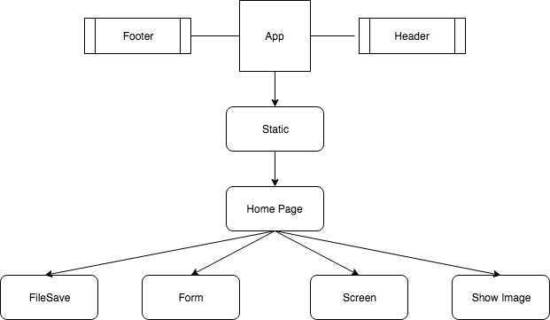

# _Entertainment Security_

#### By _**Tavish OKeefe**_

## Description

_This application will provide a fun way for clients to add security features to their devices._

_A user will be able to view a "screensaver" type page, with an image (which in the future, will be dynamic). On this page the user will need to click on a series of places (dynamic images and sounds in the future), in a certain order, to have access to the computer. [A series of clicks on the page, in a certain order, will allow the user to proceed.]

If the user clicks on the wrong places, or if the user clicks on the right places in the wrong order, a picture will be taken of the user. This image will be saved to an external database, which only the person who set up the application has access to, as well as locally on their device, for fun image manipulation with the application of the users choosing._

## Specifications

## _Setup/Installation Requirements_

* _Clone repository to your desktop_
* _Open in Atom, or text and source code editor of your choosing._
* _Run npm install from CLI._
* _Run npm run start from CLI._

## Known Bugs

_There are no known bugs at this time._

## Support and contact details

_Tavish OKeefe: okeefe.tavish@gmail.com_

## Technologies Used

* _JSX_
* _React_
* _Javascript_
* _HTML_
* _eslint_

### License

Copyright (c) 2019, _Tavish McKenzie O'Keefe_  

All rights reserved. No part of this application may be reproduced, distributed, or transmitted in any form or by any means, including photocopying, recording, or other electronic or mechanical methods, without the prior written permission of the publisher, except in the case of brief quotations embodied in critical reviews and certain other noncommercial uses permitted by copyright law.
